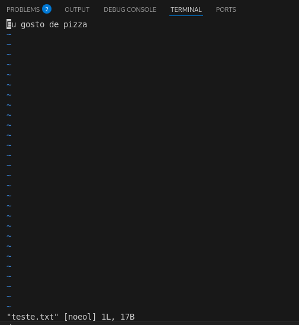

# cibersecurity-desafio-ransomware
Este projeto foi desenvolvido como parte do bootcamp de cibersegurança da DIO em parceria com o Santander. O objetivo é demonstrar de forma simples o funcionamento de um ransomware, criando scripts em Python para criptografar e descriptografar um arquivo.

